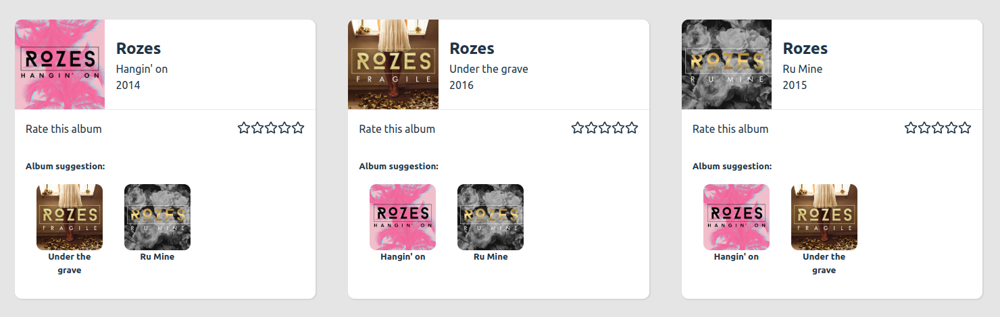

# Le CSS dans React : le niveau supérieur

J'ai choisi utiliser la bibliothèque "styled components", car à mon avis le rendu est très lisible et modifiable. On peut réutiliser des composants déjà crées en les adaptant à un autre composant.